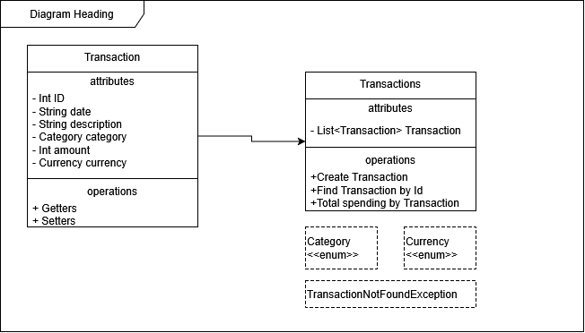

# Banking-Service
Making a mock banking service to try some new things with Springboot stack

Starting with a basic Java project implementing a simple transaction tracker design as detailed below

## UML Diagram

[Editable Draw.io file](docs/TransactionServiceUML.drawio)
